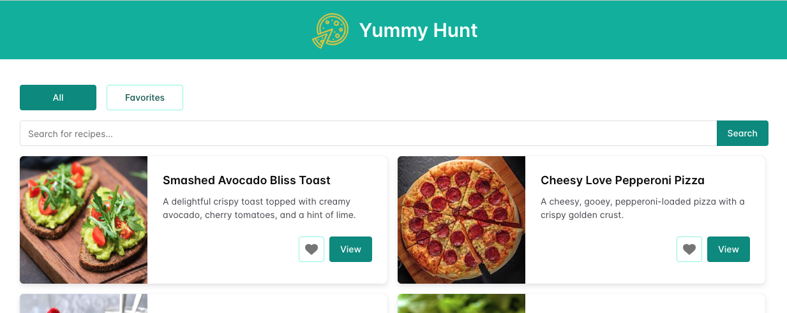

# Yummy Hunt

The solution for frontend technical assessment:

- View recipe list
- Search for recipes by keyword in title and ingredients
- View recipe detail in a drawer
- Save recipe to favorite list

## Quick Start

1. prerequisite, [Node.js](https://nodejs.org/en) installed (v22.13.1 was used)
1. clone the repository `git clone git@github.com:kryukovaolga/yummy-hunt.git`
1. open folder `cd yummy-hunt`
1. install dependencies `npm install`
1. start development server `npm run dev`; Open http://localhost:5173 in your browser
1. build for production `npm run build`
1. run tests `npm run test `

## Technology

Yummy Hunt is built using the following technologies:

- **Frontend:**

  - [React 19](https://react.dev/)
  - [Chakra UI](https://chakra-ui.com/)
  - [React Icons](https://react-icons.github.io/react-icons/)

- **Tooling & Build:**

  - [Vite](https://vite.dev/)
  - [Typescript](https://www.typescriptlang.org/)

- **Linting & Formatting:**

  - [ESLint](https://eslint.org/)

- **Testing:**
  - [Vitest](https://vitest.dev/)
  - [Testing Library (React & DOM)](<(https://testing-library.com/)>)

## Solution Assumptions and Further Development

This implementation provides a basic solution with key functionalities. Below are the assumptions made and possible improvements for a real-world application:

- **Testing:**

  - Only couple of tests are implemented (smoke test, mobile/desktop render check).
  - In a production-ready solution, each functional component should have dedicated tests.

- **Search Functionality:**

  - A full-featured solution should allow searching by keywords and other attributes, with backend support.

- **Recipe Detail View:**

  - The detail view is currently displayed in a drawer.
  - A better approach would be using routing, allowing a dedicated page with a shareable URL.

- **Error Boundaries:**

  - Error boundaries are not managed in this project.
  - A real-world solution should include error boundaries to catch JavaScript errors in the UI and provide fallback UI for better user experience.

- **Data Handling:**

  - The app uses mocked data, assuming the backend implementation is in place.
  - A real-world solution should fetch data from an API and handle search on the backend.

- **Performance Considerations:**

  - The recipe list is small in this version.
  - In production, pagination and virtualization should be implemented for better performance.

- **Build & Deployment:**
  - The project does not include Docker files or scripts for CI/CD integration.
  - Future development should add these for better deployment and automation.
